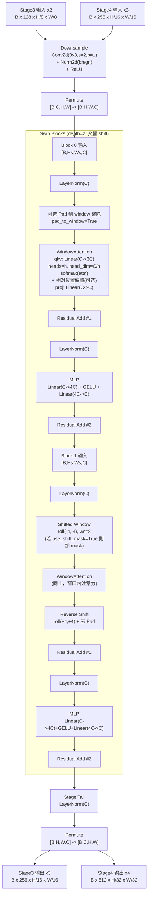
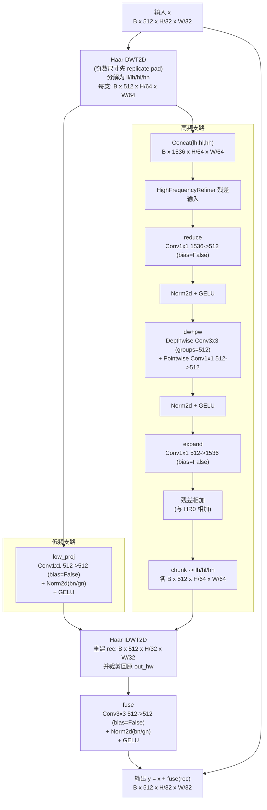

# SwinStage 与频域解耦细化结构图

> 对应代码：`models/swin_transformer.py`、`models/res_swin_unet.py`

## 参数与尺寸总览（当前 ResSwinUNet 默认）

- `SwinStage3`: `in=128, out=256, depth=2, heads=8, window_size=8, norm_type=bn`
- `SwinStage4`: `in=256, out=512, depth=2, heads=8, window_size=8, norm_type=bn`
- `WaveletDecoupledBottleneck`: `channels=512, norm_type=bn`（仅当 `use_wavelet_bottleneck=True`）
- `_make_norm2d`:
  - `bn` -> `BatchNorm2d(C)`
  - `gn` -> `GroupNorm(groups<=32 且可整除 C, C)`

## 1) SwinStage 细化图（尺寸/层次/归一化）

## 2) 频域解耦瓶颈（WaveletDecoupledBottleneck）细化图

## 说明

- `SwinBlock` 的标准顺序是：`LN -> (Window Attention) -> Residual -> LN -> MLP -> Residual`。
- `depth=2` 时，block0 是非移位窗口，block1 是移位窗口（`shift_size=window_size//2=4`）。
- 频域模块中，高频分支是一个轻量残差卷积细化器（`1x1 reduce -> DWConv+PWConv -> 1x1 expand`）。
